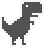

#  Dinorunner

Chrome's Dinorunner game as a standalone C, C++ and Rust library.


## Description  
This project contains a port of the famous Chrome's Dinosaur Game written in C with C, C++ and Rust bindings.
The dinorunner was inspired by https://github.com/wayou/t-rex-runner from which the trex-assets were fetched.  
The sound assets used in the demo originates from: https://www.sounds-resource.com/browser_games/googlechromedinosaurgame/sound/18002/ .

It can be subdivided in three parts:


## Bindings
### libdinorunner  
The actual library and provides access to the lower C core APIs.
It is written without any external dependency and is targetted to be used with any conceivable system.
It is designed to be used as a configurable backend library accessable to a wide range of programming languages (using i.e. CFFIs) and hardware architectures, and can directly be compiled into a project or as shared and static libraries.

**Features**:
- Hardware-agnostic: No hardware-specific dependencies - Runs everywhere
- Compiler-agnostic: No compiler-specific dependencies - Compile and go
- No `stdlib` or header lib requirement
- No heap allocations
- No `typedef`s
- Supports nightmode
- Only requires 1200 bytes to store data structure on x86_64
- Supports variadic jump heights

**Requirements**:  

The following functions need to be defined:
```c
unsigned char dinorunner_writehighscore(unsigned long high_score, void* user_data);
unsigned char dinorunner_readhighscore(unsigned long* high_score, void* user_data);
unsigned long dinorunner_gettimestamp(void* user_data);
unsigned char dinorunner_playsound(enum dinorunner_sound_e sound, void* user_data);
unsigned char dinorunner_vibrate(unsigned duration, void* user_data);
unsigned char dinorunner_clearcanvas(void* user_data);
unsigned char dinorunner_draw(enum dinorunner_sprite_e sprite, const struct pos_s* pos, unsigned char opacity, void* user_data);
unsigned char dinorunner_log(void* user_data, const char* format, ...);
```

**APIs**:  

Check out the demo for a usage example.
```c
unsigned char dinorunner_init(struct dinorunner_s* dinorunner, const struct dimension_s* dimension, void* user_data);
unsigned char dinorunner_update(struct dinorunner_s* dinorunner);
unsigned char dinorunner_getversion(struct version_s* version);
unsigned char dinorunner_isinverted(const struct dinorunner_s* dinorunner, unsigned char* night_mode);
unsigned char dinorunner_isalive(const struct dinorunner_s* dinorunner, unsigned char* activation_status);
void dinorunner_seed(unsigned short random_seed);
void dinorunner_onkeyup(struct dinorunner_s* dinorunner);
void dinorunner_onkeydown(struct dinorunner_s* dinorunner);
void dinorunner_onkeynone(struct dinorunner_s* dinorunner);
```

**Usage**:  

```bash
cmake -DCMAKE_BUILD_TYPE=Release -S dinorunner -B dinorunner/build && cmake --build dinorunner/build
```
See `dinorunner/lib` for the generated libraries objects. With 
```bash
sudo cmake --install dinorunner/build/
```
the libraries can be installed system-wide.  
With CMake:
```cmake
include(FetchContent)
FetchContent_Declare(
    DINORUNNER
    GIT_REPOSITORY https://github.com/AKJ7/dinorunner
    GIT_TAG master
    GIT_PROGRESS TRUE
    SOURCE_SUBDIR dinorunner
)
FetchContent_MakeAvailable(DINORUNNER)
if (${CMAKE_VERSION} LESS 3.18)
    add_subdirectory("${dinorunner_SOURCE_DIR}/dinorunner")
endif()
add_executable(cpp-example main.cpp)
target_link_libraries(cpp-example PUBLIC dinorunner::dinorunner_static)
```

### dinorunner-cpp   
C++-17 bindings of the C-libdinorunner methods.

**Requirements**:  

The C-APIs are encapsulated in a namespace called `dinorunner::` and a class `dinorunner::Dinorunner`.
The virtual functions of `dinorunner::Dinorunner` need to be implemented:

**APIs**:  

```cpp
namespace dinorunner {
static inline std::optional<Version> GetVersion();
static inline void Seed(unsigned short random_seed);
class Dinorunner {
 public:
  Dinorunner(const Dimension& game_dimension);
  inline bool Init();
  inline bool Update();
  inline std::optional<bool> IsInverted();
  inline std::optional<bool> IsAlive();
  inline void KeyUp() noexcept;
  inline void KeyDown() noexcept;
  inline void KeyNone() noexcept;
  virtual bool ReadHighScore(unsigned long& high_score);
  virtual bool WriteHighScore(unsigned long high_score);
  virtual unsigned long GetTimestamp();
  virtual bool PlaySound(Sound sound);
  virtual bool Vibrate(unsigned duration);
  virtual bool ClearCanvas();
  virtual bool Draw(Sprite sprite, const Pos& pos, unsigned char opacity);
  virtual bool Log(const char* message);
};
```

**Usage**:  

Just include `binding/cpp/include/dinorunner.hpp` and link the core libraries as shown above, or with CMake:

```cmake
include(FetchContent)
FetchContent_Declare(
    DINORUNNER_CPP
    GIT_REPOSITORY https://github.com/AKJ7/dinorunner
    GIT_TAG master
    GIT_PROGRESS TRUE
    SOURCE_SUBDIR binding/cpp
)
FetchContent_MakeAvailable(DINORUNNER_CPP)
if (${CMAKE_VERSION} LESS 3.18)
    add_subdirectory("${dinorunner_cpp_SOURCE_DIR}/binding/cpp")
endif()
add_executable(cpp-example main.cpp)
target_link_libraries(cpp-example PUBLIC dinorunner::dinorunner_static_cpp)
```


### dinorunner-rust
Rust binding of the C-API


## Demo  
<p align="center">
  
</p>   
<p align="center">
  
</p>


A running example can be found inside `demo/sdl`. 
It uses sdl2 to process user input and display the output of `libdinorunner` to the screen. 
Using CMake, the dependencies can be automatically downloaded, locally built, then linked to the demos. This can be done using 
```shell
cmake -DCMAKE_BUILD_TYPE=Release -DDINORUNNER_SDL_EXAMPLE_VENDORED=ON -S demo -B demo/build && cmake --build demo/build && demo/sdl/bin/dinorunner_sdl
```
In case SDL2, SDL2-Image and SDL2-gfx are already installed, simply run
```
cmake -DCMAKE_BUILD_TYPE=Release -S demo -B demo/build && cmake --build demo/build && demo/sdl/bin/dinorunner_sdl
```
to build and run the executable. The dependencies can manually be installed using 
```shell
sudo apt -y install libsdl2-dev libsdl2-image-dev libsdl2-gfx-dev
```
This project also provides a preset docker container into which the program compiles and runs.
Before running the examples in a docker container, the x-server needs to permit access to client outside its host. This is done using: `xhost +`.
The simplest way to run the program is using docker-compose:
```shell
docker compose -f docker-compose.yml up dinorunner
```

## TODO  
- [x] Add sound and vibration support
- [x] Improve configurability
- [x] Add night mode
